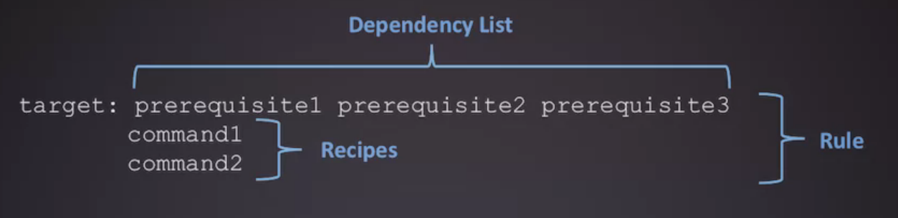
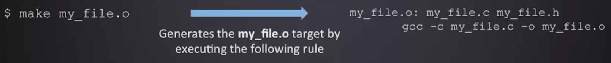
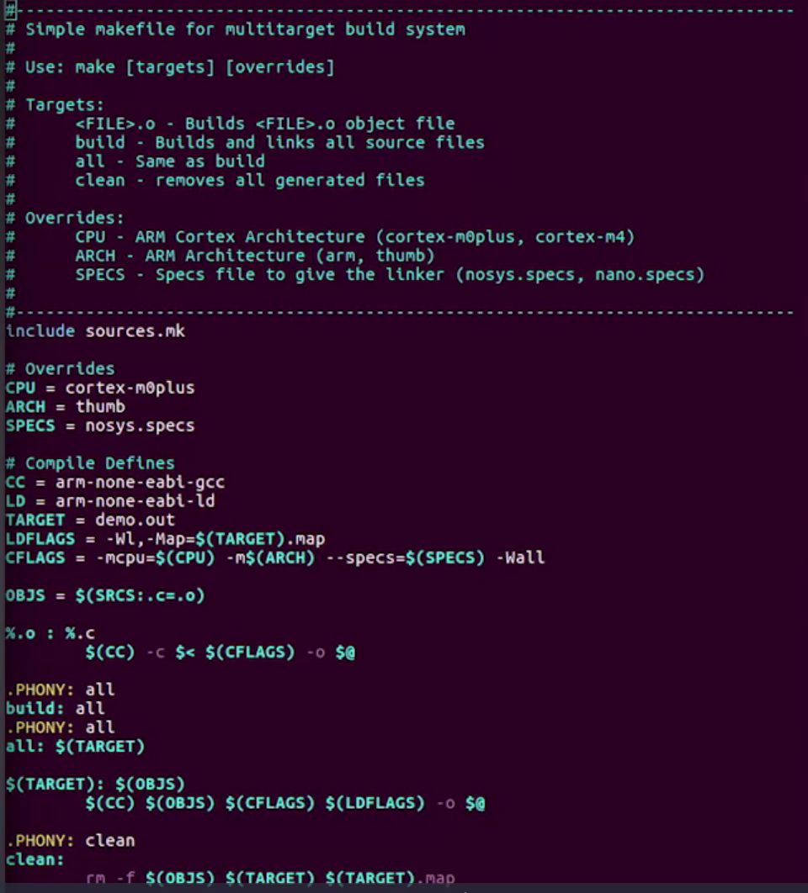
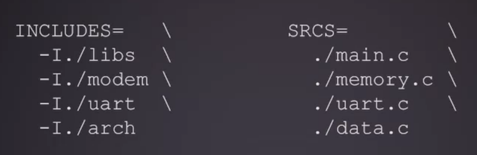
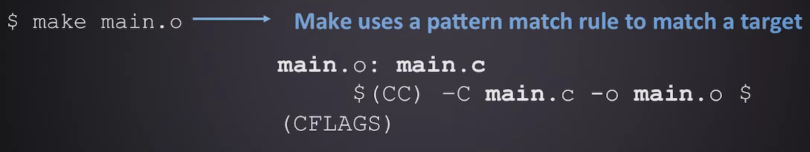
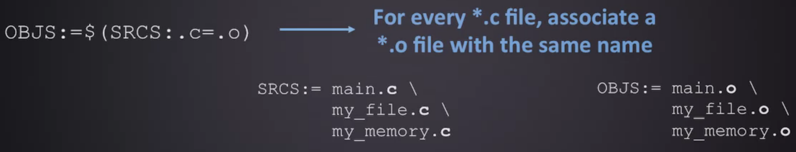

# Exemplo de makefile

```Makefile
#
# A simple makefile for managing build of project composed of C source files.
#


# It is likely that default C compiler is already gcc, but explicitly
# set, just to be sure
CC = gcc

# The CFLAGS variable sets compile flags for gcc:
#  -g        compile with debug information
#  -Wall     give verbose compiler warnings
#  -O0       do not optimize generated code
#  -std=c99  use the C99 standard language definition
CFLAGS = -g -Wall -O0 -std=c99

# The LDFLAGS variable sets flags for linker
#  -lm   says to link in libm (the math library)
LDFLAGS = -lm

# In this section, you list the files that are part of the project.
# If you add/change names of source files, here is where you
# edit the Makefile.
SOURCES = demo.c vector.c map.c
OBJECTS = $(SOURCES:.c=.o)
TARGET = demo


# The first target defined in the makefile is the one
# used when make is invoked with no argument. Given the definitions
# above, this Makefile file will build the one named TARGET and
# assume that it depends on all the named OBJECTS files.

$(TARGET) : $(OBJECTS)
    $(CC) $(CFLAGS) -o $@ $^ $(LDFLAGS)

# Phony means not a "real" target, it doesn't build anything
# The phony target "clean" is used to remove all compiled object files.

.PHONY: clean

clean:
    @rm -f $(TARGET) $(OBJECTS) core
```

## Macros

- The line `OBJECTS = $(SOURCES:.c=.o)` defines the OBJECTS macro to be the same as the SOURCES macro, except that every instance of '.c' is replaced with '.o' - that is, this assignment is equivalent to `OBJECTS = demo.o vector.o map.o`. 

- There are also two built-in macros used by the makefile, `$@` and `$^`; these evaluate to **demo** and **demo.o vector.o map.o**, respectively, but we will need to learn a bit about targets before we find out why.

```Makefile
demo : demo.o vector.o map.o
    gcc -g -Wall -o demo demo.o vector.o map.o -lm

.PHONY: clean

clean:
    @rm -f demo demo.o vector.o map.o core
```

## Targets

```Makefile
target-name : dependencies
    action
```

The target name is generally the name of the file that will be produced when this target is built. The first target listed in a makefile is the default target, meaning that it is the target which is built when make is invoked with no arguments; other targets can be built using make [target-name] at the command line. 

```Makefile
[filename].o : [filename].c
    $(CC) $(CFLAGS) -o [filename].o [filename].c
```

Phony targets Note that the clean target in our sample Makefile doesn't actually create a file named 'clean', and thus doesn't fit the pattern which we've been describing for targets. Rather, the clean target is used as a shortcut for running a command which clears out the project's build files (the '@' at the beginning of the command tells Make not to print it to the terminal when it is being run). We flag targets like this by listing them as "dependencies" of `.PHONY`, which is a pseudo-target that we'll never actually build. When the Make utility encounters a phony target, it will run the associated command automatically, without performing any dependency checks.

link: 
- https://www.coursera.org/lecture/introduction-embedded-systems/7-makefiles-part-1-4d7SV
- https://www.coursera.org/browse?source=deprecated_spark_cdp
- https://www.coursera.org/specializations/academic-english


Internal macros

- Internal macros are predefined in make.
- `make -p` to display a listing of all the macros, suffix rules and targets in effect for the current build.

Special macros

- The macro `@` evaluates to the name of the current target.

```Makefile
prog1: $(objs)
    $(CXX) -o $@ $(objs)
```
is equivalent to

```Makefile
prog1: $(objs)
    $(CXX) -o prog1 $(objs)
```
Suffix rules

A way to define default rules or implicit rules that make can use to build a
program. There are double-suffix and single-suffix.

- Suffix rules are obsolete and are supported for compatibility. Use pattern
rules (a rule contains character `%`) if possible.

- Doubles-suffix is defined by the source suffix and the target suffix. E.g. 

```Makefile
.cpp.o:
    $(CC) $(CFLAGS) -c $<
```
> This rule tells make that .o files are made from .cpp files.
>
> `$<` is a special macro which in this case stands for a ".cpp" file that is used to produce a ".o" file.

- This is equivalent to the pattern rule `%.o: %.cpp`

```Makefile
%.o: %.cpp
    $(CC) $(CFLAGS) -c $<
```
Command line macros

- Macros can be defined on the command line. E.g. `make DEBUG_FLAG=-g`

How Does Make Work?

- The `make` utility compares the modification time of the target file with the modification times of the dependency files. Any dependency file that has a more recent modification time than its target file forces the target file to be recreated.

- By default, the first target file is the one that is built. Other targets are checked only if they are dependencies for the first target.

- Except for the first target, the order of the targets does not matter. The make utility will build them in the order required. 

```Makefile
#This is a comment line
CC=g++
#CFLAGS will be the options passed to the compiler
CFLAGS=-c -Wall
OBJECTS=main.o hello.o factorial.o
all: prog

prog: $(OBJECTS)
    $(CC) $(OBJETCS) -o prog

%.o: %.cpp
    $(CC) $(CLFAGS) $<

clean:
    rm -rf *.o
```

# Compiling and invoking GCC

[Site](https://www.coursera.org/lecture/introduction-embedded-systems/2-compiling-and-invoking-gcc-UJroz)

Direct build process: 

- Sources files: `*.c/*.h`
    - Preprocessed files: `*.i`
    - Assembly files: `*.s`
- Objects files: `*.o`
    - Library files: `*.a`
- Executable: `exe`

GNU's compiler collection (GCC) Toolchain:

- gcc: Preprocessor -> Compiler ->
- as: Assembler ->
- ld: Linker -> Locator

```Bash
ls -la /usr/bin/*gcc
```

Compiling:

    gcc [OPTIONS] [FILE]

    gcc --version
    which gcc
    man gcc

Options:

- `-c`: compile and assemble file, do not link
- `-o FILE`: compile, assemble, and link to OUTPUT_FILE
- `-g`: generate debuggin information in executable
- `-Wall`: enable all warnings messages
- `-Werror`: treat all warnings as erros
- `-I<DIR>`: include this `<DIR>` to look for Header Fiels
- `-ansi`: specify which starndard version to use (ex: c89, c99)
- `-v`: verbose output from GCC

    gcc -std=c99 -Werror -o main.out main.c

Preprocessor directives:

- #define, #undef
- #ifndef, #ifdef, #endif
- #include
- #warning, #error
- #pragma

- #if-else directives:
    - #ifdef
    - #ifndef
    - #elif
    - #else
    - #endif - end of block (required)

Creating header and implementation files

- Libraries - collection of software (precompiled or direct sources)
- Modules - software organization that each module has encapsulated certain funcitonality within a library 

Creating modules

- Implementation (*.c): contains the function definitions or the actual implementation details

```C
// memory.c
#include "memory.h"
char memzero(char * src, int length){
    int i;
    for(i=0; i<length; i++){
        *src++ = 0;
    }
}
```

- Header files (*.h): contain the functino declarations, macros, and derived data type definitions (structs, enums)

```C
// memory.h
#ifndef __MEMORY_H__
#define __MEMORY_H__

char memzero(char * src, int length);

#endif /* __MEMORY_H__ */
```

- main.c:

```C
#include "memory.h"
#include "memory.h"
int main(){
    char arr[10];
    memzero(arr, 10);
    return 0;
}
```

Include guards: top of header file contains a `#ifndef` statement (protects agains redundant includes). 
- These include guards protect the `main file` from repeated declarations.
- No error here because only one declartion is used

Pragma once

- one-line included guard
- non-standard
- not portable
  
```C
// memory.h
#pragma once

char memzero(char * src, int length);
```

- main.c:

```C
#include "memory.h"
#include "memory.h"
int main(){
    char arr[10];
    memzero(arr, 10);
    return 0;
}
```

- No error here because only one declaration is used

Header files

- Header files are the `interface`
- Anything you want to give access to, put in header file
- Make informative function comments in header file
    - Function description
    - **Inputs**: type and description
    - **Return**: type and description

```C
// memory.h
#ifndef __MEMORY_H__
#define __MEMORY_H__

/*****************************************************
* memzero() - Takes a pointer to a location in memory
*             and sets the contents to zero for a 
*             length bytes.
* char * src: Pointer starting byte
* int length: Number of bytes to zero
* char (return): Success or Failure of operation
*****************************************************/
char memzero(char * src, int length);

#endif /* __MEMORY_H__ */
```

Including precompiled libraries

- stdlib.h, math.h, stdio.h
- These libraries are likely already optimized

Compiled libraries

- Static libraries: directly linked into your output executable
    - Installed with the program image as part or the executable
    - Create using archiver
- Shared libraries: linked dynamically at runtime with your executable
    - Pre-installed onto target
    - Used for applications with an operating system
    - Create with **shared** flag

> The static library is built into the executable image
>
> Shared library: your executable is placed in separate regions than the libraries

Linker flags:

- `-map [NAME]`: outputs a memory map file [NAME] from the result of linking
- `-T [NAME]`: spedifies a linker script name [NAME]
- `-o [NAME]`: place the output in the filename [NAME]
- `-O<#>`: the level of optimizations from \[#=0-3](-O0, -O1, -O2, -O3)
- `-Os`: optmize for memory size
- `-z stacksize=[SIZE]`: the amount of stack space to reserve
- `-shared`: produce a shared library (dynamic linking library)
- `-l[LIB]`: link with library
- `-L[DIR]`: include the following library path
- `-Wl, <OPTION>`: pass optino to linker from compiler3
- `-Xlinker <OPTION>`: pass option to linker from compiler

Building manually

- Building can be tedious
    - Many GCC flags
    - Many independent commands
    - Many build targets
    - Many supported architectures
    - Many source files

Linux kernel exemple:

- *.c files: 23.000
- *.h files: 18.000
- *.s files: 1.400

> Manually compiling each file and linking is NOT scalable for large software projects or large teams

- Build manually can
    - Cause consistency issues
    - Waste development time
    - Large chance for human error
 - Build Management Software (or Build Automation) provides a simple and consistent method for producing a target executable
- Automated the process of
    - Preprocessing
    - Assembly
    - Compiling
    - Linking
    - Relocating
- GNU Toolset performs all operations using `make`
    - Preprocessing
    - Assembling
    - Compiling
    - Linking
    - Relocating

> Assembler: as
> 
> Compiler: gcc
> 
> Linker: ld
> 
> Make: make

Makefiles

- One or more files used to tell `make` how to build a particular project
    - Invoked from the commmand line
- Makefiles have build `target` or buld `rules`
    - These are `recipes` for how to build a particular executable or non-source file
- Executables can have `dependencies`
    - Requirements needed for a particular recipe
    - These can be auto-generated from make
- Many multiple rules can be executed for any given instance of make that is run
    - Specify target you wish to execute when invoking make

```Bash
# Examples of makefile targets
make main.o
make all
make clean
```

- If no taret is speficied, defaults to first defined target in the makefile

```Bash
make
```

- One or more files used to tell `make` how to build a particula project
    - makefile, Makefile, sources.mk, includes.mk, ...
- Makefiles have build targets or build rules
    - make all, make clean, make main.out, make main.o
- Targets can have `dependencies` or `prerequisites`

```Makefile
main.out: main.o my_file.o
    gcc -g -W1, -Map=main.map -o main.out main.o my_file.o
```

- A build `rule` requires a specific syntax of `target:`, prerequisites, and commands



- Simple my_file.o build rule: Depends on my_file.c and my_file.h



Makefile syntax

- Comments start with a `#`
- Can include other makefiles
- Line continuation is done with a `\`
- Can create (`NAME=`) and use variables (`$(NAME)`)
- Can have multiple rules (`my_file.o, main.o, main.out`)
- Command lines start with a tab
- Targets can depend on other targets (`my_file.o, main.o, main.out`)

```Makefile
# This is a comment

# This includes another file
include sources.mk

# Variable & Line Continuance
FLAGS = -g \
        -Werror \
        -std=c99

# my_file.o target binary
my_file.o: my_file.h my_file.c
    gcc $(FLAGS) -c -o my_file.o my_file.c

# main.o target binary
main.o: my_file.h
    gcc $(FLAGS) -c -o main.o main.c

# Main Target Executable
main.out: main.o my_file.o
    gcc -o main.out main.o my_file.o
```

```Makefile
# sources.mk: cat sources.mk
SRCS = main.c \
       my_file.c \
       my_memory.c
```



Makefile variables

- Variables can be set to strings of text and can include other variables
    - Variable access is done with the `$(variable-name)` syntax
- Recursively Expand Variables `(=)`
    - Expands whenever used
- Simply Expand Variables (`:=`)
    - Expands `once` at the time of definition
- Use variables for things like
    - Compiler flags: `CFLAGS` 
    - Linker flags: `LDFLAGS`

```Makefile
# Example recursively expanded variables
CSTD=c89
CPU=cortex-m0plus
CC=arm-none-eabi-gcc
# Example simply expanded variables
ARCH:=$(shell arch)
CWD:=$(shell pwd)
OS:=$(shell uname)
# Special examples that run linux commands to set data

#C-Flags example variables
CFLAGS = -g -std=$(CSTD) -mcpu=$(CPU) -mthumb
```

Include paths and sources

- Can control what `directions` and `source files` are used for building 
    - Includes provide path to code (absolute or relative paths)
    - Sources determine what needs to be built



- Can reference a variable for include directions and source files
    - Creates dynamic targets instead of statically defined targets

Build the executable

- Use variables in your target rules

```Makefile
main.out: main.o my_file.o
    gcc -W1,map=main.map -I./inc -o main.out main.o my_file.o

$(TARGET): $(OBJS)
    $(CC) $(CFLAGS) $(INCLUDES) $(LDFLAGS) -o $(TARGET) $(OBJS)
```

- Automatic Variables - variables in a recipe with a scope

```Makefile
$(TARGET): $(OBJS)
    $(CC) $(CFLAGS) $(LDFLAGS) $(INCLUDES) -o $@ $^
```

    $@ - target
    $^ - all prerequisites

Pattern matching

- Pattern matching operator `%`
    - Pattern matches a target object rule with an associated source file
  
```Makefile
%.o: %.c
    $(CC) -C $@ -o $< $(CFLAGS)
```



- Pattern matches are dynamic
    - Need a way to track generated object files
- Can use source variables (SRCS) to generate a list of object files variable (OBJS)



Target suggestions

- Targets do NOT have to be a file: Can make your own target names!
    - all - builds final executable binary
    - Need to have a `.PHONY` directive
    - clean - remove all generated and object files
    - debug - builds a debug image with debug symbols enabled

```Makefile
.PHONY: all
all: main.out
main.out: $(OBJS)
    gcc $(CFLAGS) -o main.out $(OBJS)

.PHONY: clean
clean:
    rm main.map $(OBJS) main.out
```

> Whatever you want!!!

Functions and dynamic variables

- Can use make functions to process info
    - Output goes into variables
    - shell, file, origin, conditional, etc
  
```Makefile
$(funciton arguments)
```

- `Shell` funcitons are one form `command expansion` that can gather data from the system outside of make
    - Use the syntax `$(shell command`

```Makefile
# Shell command variables

ARCH:=$(shell arch)
CWD:=$(shell pwd)
OS:=$(shell uname)
```

- Use conditional statements to change flags

```Makefile
OS:=$(shell uname -s)
ifeq ($(OS), Linux)
    CC=gcc
endif
```

Overriding variables

- Pass input parameters into make to alter build
    - Architecture to build for
    - CPU
    - Platform/Board
    - Compiler instance
    - Compiler/Linker options
  
```Shell
make all PLATFORM=msp432
make all CPU=cortex-me=4
make all ARCH=arm
```

> Input can set variables or be used conditionally

```Makefile
ifeq ($(PLATFORM),MSP)
    CPU=cortex-m4
endif

ifeq ($(PLATFORM),FRDM)
    CPU=cortex-m0plus
endif
```

- By making a target variable based, you can change/alter flags for linker or compiler

```Makefile
$(TARGET): $(OBJS)
    $(CC) $(CFLAGS) $(INCLUDES) $(LDFLAGS) -o $(TARGET) $(OBJS)
```
> Can make our target rules extremely generic yet dynamic!

Special variables

- Variables implicity used by make
    - CC - compiler
    - CPP - preprocessor program
    - AS - assembler (as) program
    - LD - linker (ld)
    - CFLAGS - C program flags
    - CPPFLAGS - C preprocessor flags
    - ASFLAGS - flags for assembler
    - LDFLAGS - C program linker flags
    - LDLIBS - extra flags for libraries

> Make has internal rules it uses for targets not defined
> 
> You provide the flags


# GCC and Make

Compiling, linking and building C/C++ applications [link](https://www3.ntu.edu.sg/home/ehchua/programming/index.html)

Compiling/link a simple c++ program: hello.cpp

```Cpp
#include <iostream>
using namespace std;
 
int main() {
   cout << "Hello, world!" << endl;
   return 0;
}
```

You need to use g++ to compile C++ program. A few commonly-used GCC compiler options are:

```Shell
g++ -Wall -g -o Hello.exe Hello.cpp
```

- `-o`: specifies the output execcutable filename
- `-Wall`: prints "all" Warning messages
- `-g`: generates additional symbolic debugging information for use with gdb debugger

The above command compile the source file into object file and link with other object files and system libraries into executable in one step. You may separete compile and link in two steps as follows:

```
g++ -c -Wall -g Hello.cpp
g++ -g -o Hello.exe Hello.o
```

The options are:

- `-c`: compile into object file "Hello.o". by default, the object files has the same name as the source with extension of ".o" (theres is no need to specify -o option). No linking with other object files or libraries
- Linking is performed when the input file are object files ".o" (instead of source file ".cpp" or ".c"). GCC uses a separete linker program (called ld.exe) to perform the linking.

Suppose that your program has two source files: file1.cpp and file2.cpp. You could compile all of them ina single command:

    g++ -o myprog.exe file1.cpp file2.cpp

However, we usually compile each of the source files separately into object file, and link them together in the later stage. In this case, changes in one file does not require re-compilation of the other files

    g++ -c file1.cpp
    g++ -c file2.cpp
    g++ -o myprog.exe file1.o file2.o

To compile and link C/C++ program into a shared library (".dll" in Windows, ".so" in Unixes), use `-shared` option.

GCC compiles a C/C++ program into executable in 4 steps:

1. Pre-processing: via GNU C Preprocessor (cpp.exe) which includes the header (`#include`) and expands the macros (`#define`). The result intermediate file "hello.i" contains the expanded source code

> cpp hello.c > hello.i

1. Compilation: The compiler compiles the pre-processed source code into assembly code for a specific processor. The `-S` option spedifies to produce assembly code, instead of object code. The resultant assembly file is "hello.s"


> gcc -S hello.i


3. Assembly: the assembler (as.exe) converts the assembly code into machine code in the object file "hello.o"
   
> as -o hello.o hello.s

4. Linker: Finally, the linker (ld.exe) links the object code with the library code to procude an executable file "hello.exe"

> ld -o hello.exe hello.o ...libraries...

You can see the detailed compilation process by enabling `-v` (verbose) option. For exemple,

> gcc -v -o hello.exe hello.c

You can use the `-Dname` option to define a macro, or `-Dname=value` to define a macro with a value. The value should be enclosed in double quotes if it contains spaces.

# Headers (.h), Static Libraries (.lib, .a) and Shared Library (.dll, .so)

A library is a collection of pre-compiled object files that can be linked into your programs via the linker. Examples are the system functions such as printf() and sqrt().

There are two types of external libraries: static library and shared library.

1. A static library has file extension of ".a" (archive file) in Unixes or ".lib" (library) in Windows. When your program is linked against a static library, the machine code of external functions used in your program is copied into the executable. A static library can be created via the archive program "ar.exe".

2. A shared library has file extension of ".so" (shared objects) in Unixes or ".dll" (dynamic link library) in Windows. When your program is linked against a shared library, only a small table is created in the executable. Before the executable starts running, the operating system loads the machine code needed for the external functions - a process known as dynamic linking. Dynamic linking makes executable files smaller and saves disk space, because one copy of a library can be shared between multiple programs. Furthermore, most operating systems allows one copy of a shared library in memory to be used by all running programs, thus, saving memory. The shared library codes can be upgraded without the need to recompile your program.

Because of the advantage of dynamic linking, GCC, by default, links to the shared library if it is available. You can list the contents of a library via "nm filename".

Searching for Header Files and Libraries (-I, -L and -l)

When compiling the program, the compiler needs the header files to compile the source codes; the linker needs the libraries to resolve external references from other object files or libraries. The compiler and linker will not find the headers/libraries unless you set the appropriate options, which is not obvious for first-time user.

For each of the headers used in your source (via #include directives), the compiler searches the so-called include-paths for these headers. The include-paths are specified via -Idir option (or environment variable CPATH). Since the header's filename is known (e.g., iostream.h, stdio.h), the compiler only needs the directories.

The linker searches the so-called library-paths for libraries needed to link the program into an executable. The library-path is specified via -Ldir option (uppercase 'L' followed by the directory path) (or environment variable LIBRARY_PATH). In addition, you also have to specify the library name. In Unixes, the library libxxx.a is specified via -lxxx option (lowercase letter 'l', without the prefix "lib" and ".a" extension). In Windows, provide the full name such as -lxxx.lib. The linker needs to know both the directories as well as the library names. Hence, two options need to be specified.

Default Include-paths, Library-paths and Libraries

Try list the default include-paths in your system used by the "GNU C Preprocessor" via "cpp -v":

> cpp -v

Try running the compilation in verbose mode (-v) to study the library-paths (-L) and libraries (-l) used in your system:

> gcc -v -o hello.exe hello.c

Eclipse CDT: In Eclipse CDT, you can set the include paths, library paths and libraries by right-click on the project ⇒ Properties ⇒ C/C++ General ⇒ Paths and Symbols ⇒ Under tabs "Includes", "Library Paths" and "Libraries". The settings are applicable to the selected project only.

# GCC Environment Variables

GCC uses the following environment variables:

- PATH: For searching the executables and run-time shared libraries (.dll, .so).
- CPATH: For searching the include-paths for headers. It is searched after paths specified in `-I<dir>` options. C_INCLUDE_PATH and CPLUS_INCLUDE_PATH can be used to specify C and C++ headers if the particular language was indicated in pre-processing.
- LIBRARY_PATH: For searching library-paths for link libraries. It is searched after paths specified in `-L<dir>` options.

# Utilities for Examining the Compiled Files

For all the GNU utilities, you can use "command --help" to list the help menu; or "man command" to display the man pages.

"file" Utility - Determine File Type

The utility "file" can be used to display the type of object files and executable files. For example,

    gcc -c hello.c
    gcc -o hello.exe hello.o 
    file hello.c
    file hello.o
    file hello.exe

"nm" Utility - List Symbol Table of Object Files

    nm hello.o
    nm hello.exe | grep main

"nm" is commonly-used to check if a particular function is defined in an object file. A 'T' in the second column indicates a function that is defined, while a 'U' indicates a function which is undefined and should be resolved by the linker.

"ldd" Utility - List Dynamic-Link Libraries

The utility "ldd" examines an executable and displays a list of the shared libraries that it needs. For example,

    ldd hello.exe

# GNU Make

The "make" utility automates the mundane aspects of building executable from source code. "make" uses a so-called makefile, which contains rules on how to build the executables.

You can issue "make --help" to list the command-line options; or "man make" to display the man pages.

```C
// hello.c
#include <stdio.h>
 
int main() {
    printf("Hello, world!\n");
    return 0;
}
```
Create the following file named "makefile" (without any file extension), which contains rules to build the executable, and save in the same directory as the source file. Use "tab" to indent the command (NOT spaces).

```Makefile
all: hello.exe

hello.exe: hello.o
	 gcc -o hello.exe hello.o

hello.o: hello.c
	 gcc -c hello.c
     
clean:
	 rm hello.o hello.exe

```

Run the "make" utility as follows: make

Running make without argument starts the target "all" in the makefile. A makefile consists of a set of rules. A rule consists of 3 parts: a target, a list of pre-requisites and a command, as follows:

```Makefile
target: pre-req-1 pre-req-2 ...
	command
```

The target and pre-requisites are separated by a colon (:). The command must be preceded by a tab (NOT spaces).

When make is asked to evaluate a rule, it begins by finding the files in the prerequisites. If any of the prerequisites has an associated rule, make attempts to update those first.

In the above example, the rule "all" has a pre-requisite "hello.exe". make cannot find the file "hello.exe", so it looks for a rule to create it. The rule "hello.exe" has a pre-requisite "hello.o". Again, it does not exist, so make looks for a rule to create it. The rule "hello.o" has a pre-requisite "hello.c". make checks that "hello.c" exists and it is newer than the target (which does not exist). It runs the command "gcc -c hello.c". The rule "hello.exe" then run its command "gcc -o hello.exe hello.o". Finally, the rule "all" does nothing.

More importantly, if the pre-requisite is not newer than than target, the command will not be run. In other words, the command will be run only if the target is out-dated compared with its pre-requisite. For example, if we re-run the make command:

> make

You can also specify the target to be made in the make command. For example, the target "clean" removes the "hello.o" and "hello.exe". You can then run the make without target, which is the same as "make all".

> make clean

Try modifying the "hello.c" and run make.

NOTES:

- If the command is not preceded by a tab, you get an error message `"makefile:4: *** missing separator. Stop."`
- If there is no makefile in the current directory, you get an error message `"make: *** No targets specified and no makefile found. Stop."`
- The makefile can be named "makefile", "Makefile" or "GNUMakefile", without file extension.

# More on Makefile

Comment & Continuation

A comment begins with a # and lasts till the end of the line. Long line can be broken and continued in several lines via a back-slash (\).

Syntax of Rules

A general syntax for the rules is:

```Makefile
target1 [target2 ...]: [pre-req-1 pre-req-2 ...]
	[command1
	 command2
	 ......]

```

The rules are usually organized in such as way the more general rules come first. The overall rule is often name "all", which is the default target for make.

Phony Targets (or Artificial Targets)

A target that does not represent a file is called a phony target. For example, the "clean" in the above example, which is just a label for a command. If the target is a file, it will be checked against its pre-requisite for out-of-date-ness. Phony target is always out-of-date and its command will be run. The standard phony targets are: all, clean, install.

Variables

A variable begins with a `$` and is enclosed within parentheses (...) or braces {...}. Single character variables do not need the parentheses. For example, `$(CC), $(CC_FLAGS), $@, $^`.

Automatic Variables

Automatic variables are set by make after a rule is matched. There include:

```
$@: the target filename.
$*: the target filename without the file extension.
$<: the first prerequisite filename.
$^: the filenames of all the prerequisites, separated by spaces, discard duplicates.
$+: similar to $^, but includes duplicates.
$?: the names of all prerequisites that are newer than the target, separated by spaces.
```

For example, we can rewrite the earlier makefile as:

```Makefile
all: hello.exe
 
# $@ matches the target; $< matches the first dependent
hello.exe: hello.o
	gcc -o $@ $<

hello.o: hello.c
	gcc -c $<
     
clean:
	rm hello.o hello.exe
```
Virtual Path - VPATH & vpath

You can use VPATH (uppercase) to specify the directory to search for dependencies and target files. For example,

```Makefile
# Search for dependencies and targets from "src" and "include" directories
# The directories are separated by space
VPATH = src include
```
You can also use vpath (lowercase) to be more precise about the file type and its search directory. For example,

```Makefile
# Search for .c files in "src" directory; .h files in "include" directory
# The pattern matching character '%' matches filename without the extension
vpath %.c src
vpath %.h include
```
Pattern Rules

A pattern rule, which uses pattern matching character '%' as the filename, can be applied to create a target, if there is no explicit rule. For example,

```Makefile
# Applicable for create .o object file.
# '%' matches filename.
# $< is the first pre-requisite
# $(COMPILE.c) consists of compiler name and compiler options
# $(OUTPUT_OPTIONS) could be -o $@
%.o: %.c
	$(COMPILE.c) $(OUTPUT_OPTION) $<
 
# Applicable for create executable (without extension) from object .o object file
# $^ matches all the pre-requisites (no duplicates)
%: %.o
$(LINK.o) $^ $(LOADLIBES) $(LDLIBS) -o $@
```
Implicit Pattern Rules

Make comes with a huge set of implicit pattern rules. You can list all the rule via --print-data-base option.

# A Sample Makefile

This sample makefile is extracted from Eclipse's "C/C++ Development Guide -Makefile".

```Makefile
# A sample Makefile
# This Makefile demonstrates and explains 
# Make Macros, Macro Expansions,
# Rules, Targets, Dependencies, Commands, Goals
# Artificial Targets, Pattern Rule, Dependency Rule.

# Comments start with a # and go to the end of the line.

# Here is a simple Make Macro.
LINK_TARGET = test_me.exe

# Here is a Make Macro that uses the backslash to extend to multiple lines.
OBJS =  \
 Test1.o \
 Test2.o \
 Main.o

# Here is a Make Macro defined by two Macro Expansions.
# A Macro Expansion may be treated as a textual replacement of the Make Macro.
# Macro Expansions are introduced with $ and enclosed in (parentheses).
REBUILDABLES = $(OBJS) $(LINK_TARGET)

# Here is a simple Rule (used for "cleaning" your build environment).
# It has a Target named "clean" (left of the colon ":" on the first line),
# no Dependencies (right of the colon),
# and two Commands (indented by tabs on the lines that follow).
# The space before the colon is not required but added here for clarity.
clean : 
  rm -f $(REBUILDABLES)
  echo Clean done

# There are two standard Targets your Makefile should probably have:
# "all" and "clean", because they are often command-line Goals.
# Also, these are both typically Artificial Targets, because they don't typically
# correspond to real files named "all" or "clean".  

# The rule for "all" is used to incrementally build your system.
# It does this by expressing a dependency on the results of that system,
# which in turn have their own rules and dependencies.
all : $(LINK_TARGET)
  echo All done

# There is no required order to the list of rules as they appear in the Makefile.
# Make will build its own dependency tree and only execute each rule only once
# its dependencies' rules have been executed successfully.

# Here is a Rule that uses some built-in Make Macros in its command:
# $@ expands to the rule's target, in this case "test_me.exe".
# $^ expands to the rule's dependencies, in this case the three files
# main.o, test1.o, and  test2.o.
$(LINK_TARGET) : $(OBJS)
  g++ -g -o $@ $^

# Here is a Pattern Rule, often used for compile-line.
# It says how to create a file with a .o suffix, given a file with a .cpp suffix.
# The rule's command uses some built-in Make Macros:
# $@ for the pattern-matched target
# $< for the pattern-matched dependency
%.o : %.cpp
  g++ -g -o $@ -c $<

# These are Dependency Rules, which are rules without any command.
# Dependency Rules indicate that if any file to the right of the colon changes,
# the target to the left of the colon should be considered out-of-date.
# The commands for making an out-of-date target up-to-date may be found elsewhere
# (in this case, by the Pattern Rule above).
# Dependency Rules are often used to capture header file dependencies.
Main.o : Main.h Test1.h Test2.h
Test1.o : Test1.h Test2.h
Test2.o : Test2.h

# Alternatively to manually capturing dependencies, several automated
# dependency generators exist.  Here is one possibility (commented out)...
# %.dep : %.cpp
#   g++ -M $(FLAGS) $< > $@
# include $(OBJS:.o=.dep)
```